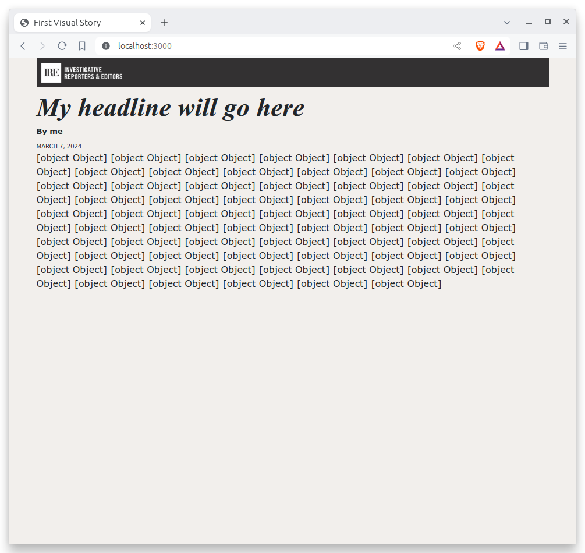
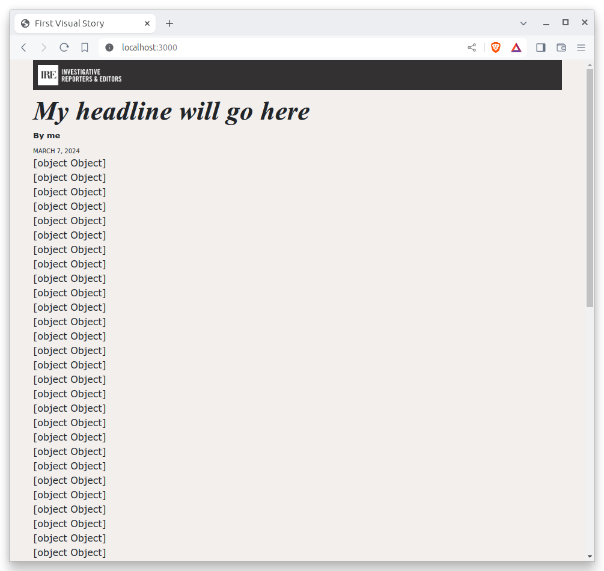

# Data

We've got our system set up. Now it's time to start telling our story. To do that, we need our data. This chapter will guide you through how to introduce it to the page.

## Import JSON

If we were writing this application entirely in the browser with traditional JavaScript we'd have to pull it in with dynamic ["AJAX"](<https://en.wikipedia.org/wiki/Ajax_(programming)>) calls that retrieve data over the web as the page is loaded in your browser.

Thanks to our framework's templating system, we can import data before the page is served. This results in a faster experience for users and opens up new ways to be creative with data.

Every newsroom's system will handle this technique a little differently. Our baker framework is preconfigured to detect files in the `_data` folder and import them into our Nunjucks templates.

Let's give it a try. Grab the [list of Harvard Park homicides](https://gist.githubusercontent.com/palewire/e0e3a3d64ed818ded354ffd99e63984b/raw/c1952a9dcdd37443aef63511c052e50f3bf51c6b/harvard_park_homicides.json) published by the Los Angeles Times. It includes every homicide victim in the neighborhood since 2000 in the [JSON data format](https://en.wikipedia.org/wiki/JSON) favored by JavaScript. Save it to `_data/harvard_park_homicides.json`.

```javascript
[
   {
      "case_number":"2017-04514",
      "slug":"eddie-rosendo-lino",
      "first_name":"Eddie",
      "middle_name":"Rosendo",
      "last_name":"Lino",
      "death_date":"2017-06-18T00:00:00.000Z",
      "death_year":2017,
      "age":23.0,
      "race":"black",
      "gender":"male",
      "image":null,
      "longitude":-118.304107484,
      "latitude":33.9904336958
   },
   {
      "case_number":"2017-03454",
      "slug":"alex-david-lomeli",
      "first_name":"Alex",
      "middle_name":"David",
      "last_name":"Lomeli",
      "death_date":"2017-05-07T00:00:00.000Z",
      "death_year":2017,
      "age":18.0,
      "race":"latino",
      "gender":"male",
      "image":null,
      "longitude":-118.300290584,
      "latitude":33.9793646958
   },
   ...
```

Return to `index.html` and add the following to the bottom to print the data out on the page. We can do that using the `{{ }}` print tags provided by Nunjucks.

```jinja

    {{ harvard_park_homicides }}

```

Now restart your test server, as we’ve done before.

```bash
npm start
```

Visit [localhost:3000](https://localhost:3000) and you should see the data dumped on the page.


## The for loop

Instead of just printing the data in one big block, let's loop through the records and print them one by one.

We'll use the `` template tags provided by Nunjucks, which allow us to use a common computer programming structure called a ["for loop"](https://en.wikipedia.org/wiki/For_loop) when we’re laying out a page.

```{code-block} jinja
:emphasize-lines: 2-4



    {{ obj }}


```

The result should look much the same.



To put each record on its own line, add a line break with a [`<br>`](https://www.w3schools.com/TAGS/tag_br.asp) tag. That's just boring old HTML. Writing pages with a templating language like Nunjucks is typically nothing more than mixing traditional HTML with the template tags that negotiate your data.

```{code-block} jinja
:emphasize-lines: 3



    {{ obj }}<br>


```




## Access attributes

That's good, but hardly informative. How do we start printing out the contents of the data? The fields in the JSON dictionary for each homicide are available by adding a `.` after the object. For instance, here's how to print the contents of the `last_name` field.

```{code-block} jinja
:emphasize-lines: 3



    {{ obj.last_name }}<br>


```

```{image} _static/hello-last-name.png
:width: 100%
```

Now the first name.

```{code-block} jinja
:emphasize-lines: 3



    {{ obj.first_name }} {{ obj.last_name }}<br>


```

```{image} _static/hello-full-name.png
:width: 100%
```

## Commit your work

Not bad. We’ve actually got some data on the page. Seems like a good moment to stop, take a break and commit our work.

Just to get in the habit, let’s start with the `status` command.

```bash
git status
```

Now let’s add all of the files we’ve changed.

```bash
git add .
```

Then we commit.

```bash
git commit -m "Printed a list of names from data"
```

Finally, push it to GitHub.

```bash
git push origin main
```

We’ve dumped the data on the page. Now let’s dress it up.
