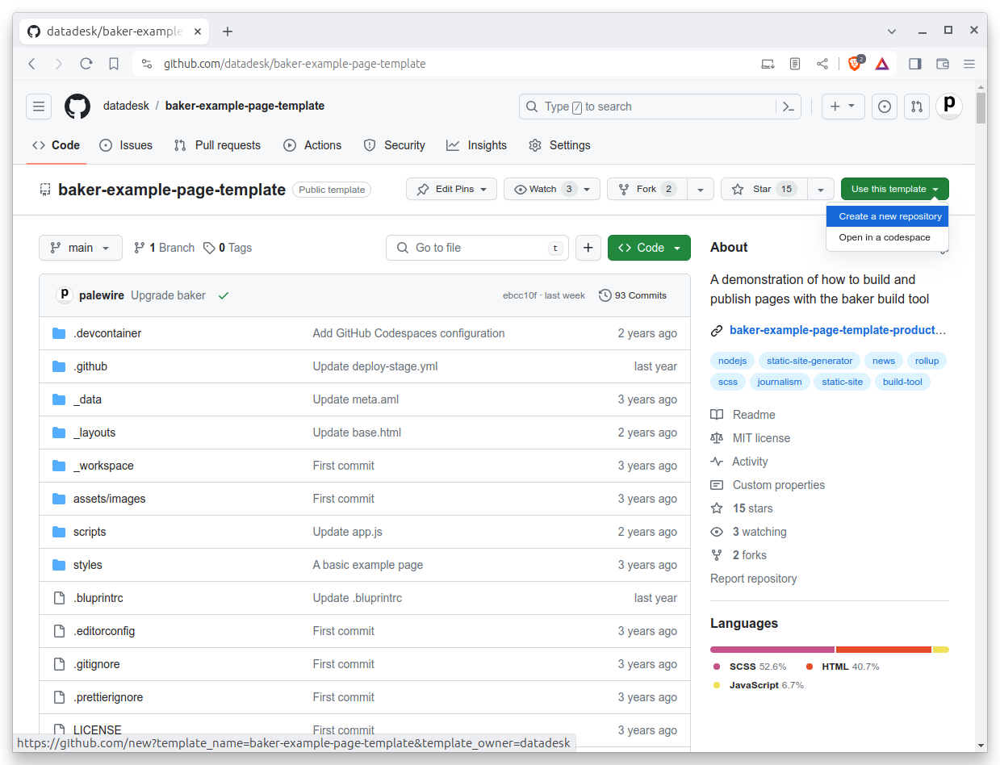

# GitHub

This chapter will show you how to get a git code repository up and running. At most news organizations where you'd be collaborating on code with other developers, you'll rely heavily on the GitHub web app.

## Why?

You can think of git as an air traffic controller. It makes sure the code you're writing at your desk and the code your colleague is writing in her home office don't clobber each other like two wayward Boeings. If you each make changes to the same lines of code, git steps in and forces you to reconcile the work before it can be combined into the published version.

Git does this by keeping a flight log. Every change to your code recorded in a series of entries known as commits. Not only does it keep you from crashing into your colleagues, it provides a comprehensive record of the project's history, which you can use to identify when bugs are introduced, and by whom.

You can then think of GitHub as an airport. It's a secure, systemized way to launch and land your code.

GitHub has become an integral part of the newsroom workflow as developers need to make updates swiftly and with confidence that all contributors' individual changes will work on the published site. Its dashboards give visibility into what work is in progress and which is final. This visibility can be tuned to let the whole world view your code or limit it to a small, trusted group.

One of the most important things GitHub can be configured to do is run safety tests on every line of code before it can publish. We won't get into testing in this tutorial, but just know that Github is intrinsic to the work of today's newsrooms.

## Create a code directory

But before we approach the runway, let's make sure your local hangar is set up properly. It always helps to store all your code in the same place, rather than scattering your work in haphazard folders around your computer.

Let's settle the issue on the command-line. Open the terminal of your choice. It will start you off in your computer’s home directory, much like your file explorer.

Verify that by using a command called [`pwd`](https://en.wikipedia.org/wiki/Pwd), which stands for present working directory. The output is the full path of your terminal’s current location in the file system. You should get back something like `/Users/palewire/`.

```bash
pwd
```

Enter the [`ls`](https://en.wikipedia.org/wiki/Ls) command to see all of the home folder’s subdirectories. The terminal should print out the same list of folders you can see via the file explorer.

```bash
ls
```

Use the [`mkdir`](https://en.wikipedia.org/wiki/Mkdir) command to create a new directory in the same style as the Desktop, Documents and Downloads folders included by most operating systems.

Since we want it to store our code, we will name this folder `Code`.

```bash
mkdir Code
```

To verify the command works, open the file explorer and navigate to your home folder. After it’s run, you should see the new directory alongside the rest.

Now jump into the new directory with the [`cd`](<https://en.wikipedia.org/wiki/Cd_(command)>) command, which operates the same as double clicking on a folder in your file explorer.

```bash
cd Code
```

In this simple exercise you’ve learned some of the most important, and most common, terminal commands.

## Create a repository

Visit [GitHub](http://www.github.com) and find the homepage for `baker-example-page-template` repository published the Los Angeles Times’s `datadesk` account. It can be found at [github.com/datadesk/baker-example-page-template](https://github.com/datadesk/baker-example-page-template).

[](https://github.com/datadesk/baker-example-page-template)

This is a special kind of repository known as a template. It’s designed to serve as a starting point for new projects. Click the [green "use this template" button](https://github.com/datadesk/baker-example-page-template/generate) in the upper right-hand corner of the page to get started. Select the "create a new repository" option.

[](https://github.com/datadesk/baker-example-page-template/generate)

On the next page, fill in a name for your copy of the repository. You can pick anything. Our example will use `my-first-visual-story`.


## Clone the repository

Return to your terminal. Use `gh` to login to GitHub, which will verify that your computer has permission to access and edit the repositories owned by your account.

```bash
gh auth login
```

After you authenticate, clone the new repository we created. Edit the code below by inserting your user name and repository. Then run it.

```bash
gh repo clone <your-username>/<your-repo>
```

````{note}
In my case, the command looks like this:

```bash
gh repo clone palewire/my-first-visual-story
```
````

After clone completes, run the `ls` command again. You should see a new folder created by `gh`.

```bash
ls
```

Use `cd` to move into the directory, where we can begin work.

```bash
cd my-first-visual-story
```

We've got our starter kit installed. Let’s get it going.
