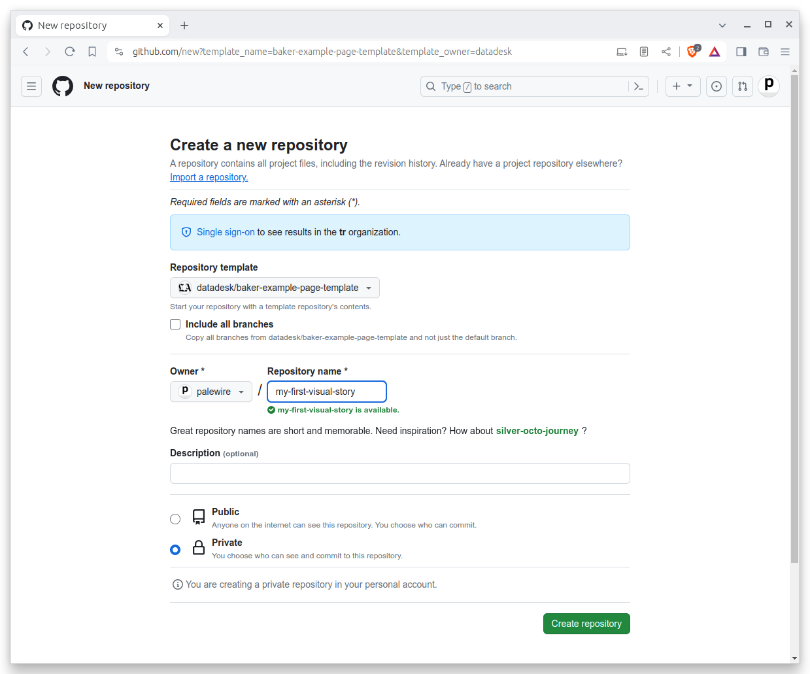

```{include} _templates/nav.html

```

# Git

This chapter will show you how to get a code repository up and running on your computer.

```{contents} Sections
  :depth: 1
  :local:
```

## Create a code directory

First things first. It always helps to store all your code in the same place, instead of haphazard folders around your computer. This way, you always know where to look if you need to find a project.

Let's settle the issue on the command-line. Open the terminal of your choice. It will start you off in your computer’s home directory, much like your file explorer.

Let’s verify that using a command called [`pwd`](https://en.wikipedia.org/wiki/Pwd), which stands for present working directory. The output is the full path of your terminal’s current location in the file system. You should get back something like `/Users/palewire/`, the path to your home directory.

```bash
pwd
```

Next let’s enter the [`ls`](https://en.wikipedia.org/wiki/Ls) command to see all of its subdirectories. The terminal should print out the same list of folders you can see in your home directory via the file explorer.

```bash
ls
```

Our first task is to create a folder to store our code.

Use the [`mkdir`](https://en.wikipedia.org/wiki/Mkdir) command to create a new directory in the same style as the Desktop, Documents and Downloads folders included by most operating systems.

We will name this folder `Code`. To verify the command works, open the file explorer and navigate to your home folder. After it’s run, you should see the new directory alongside the rest.

```bash
mkdir Code
```

Now jump into the new directory with the [`cd`](<https://en.wikipedia.org/wiki/Cd_(command)>) command, which operates the same as double clicking on a folder in your file explorer.

```bash
cd Code
```

## Create a repository

Visit [GitHub](http://www.github.com) and find the homepage for `baker-example-page-template` repository published the Los Angeles Times’s `datadesk` account. It can be found at [github.com/datadesk/baker-example-page-template](https://github.com/datadesk/baker-example-page-template).

[](https://github.com/datadesk/baker-example-page-template)

This is a special kind of repository known as a template. It’s designed to serve as a starting point for new projects. Click the [green "use this template" button](https://github.com/datadesk/baker-example-page-template/generate) near the middle of the page to get started.

[](https://github.com/datadesk/baker-example-page-template/generate)

On the next page, fill in a name for your copy of the repository. You can pick anything. Our example will use `my-first-visual-story`.



## Clone the repository

Return to your terminal. Use `gh` to login to GitHub, which will verify that your computer has permission to access and edit the repositories owned by your account.

```bash
gh auth login
```

After you authenticate, it’s time to clone the new repository we created. Edit the code below by inserting your user name and repository. Then run it.

```bash
gh repo clone <your-username>/<your-repo>
```

In my case, the command looks like this:

```bash
gh repo clone palewire/my-first-visual-story
```

After clone completes, run the `ls` command again. You should see a new folder created by `gh`.

```bash
ls
```

Use `cd` to move into the directory, where we can begin work.

```bash
cd my-first-visual-story
```

We've got our starter kit installed. Let’s get it up and running.
