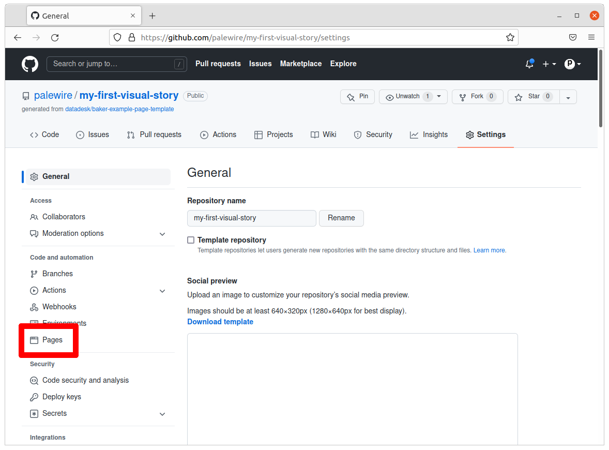
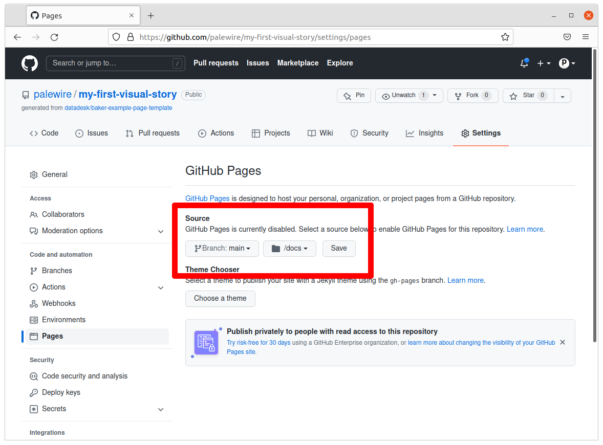

```{include} _templates/nav.html

```

# Internet

In in our last chapter, all the work we've done will finally be published online.

```{contents} Sections
  :depth: 1
  :local:
```

## The importance of being static

Our baker framework, with its tools, structure and shortcuts, has served us well. It's been a great place to experiment, organize and develop our work. But it's useless to our readers.

The HTML, JavaScript and CSS files the framework generates are all they need. We can upload the finished files our framework renders to the web and they'll be enough for anyone who wants them.

That process — converting a dynamic, living website to simple files living on the filesystem — is a common strategy for publishing news sites. It goes by different names, like "flattening," "freezing" or "baking."

Whatever you call it, it’s a solid path to cheap­, stable host­ing for simple sites. It is used across the industry for pub­lish­ing elec­tion res­ults, longform stories, spe­cial pro­jects and numerous other things.

```{note}
Examples of static news pages in the wild include:

- [A wide array of interactive graphics](https://twitter.com/PostGraphics/status/1207035549527236609) by The Washington Post
- Hundreds of Los Angeles Times stories at [latimes.com/projects](http://www.latimes.com/projects/)
- Dozens more from The Seattle Times at [projects.seattletimes.com](https://projects.seattletimes.com)
- Interactive apps by [The Dallas Morning News](https://interactives.dallasnews.com/2018/secrets-dallas-dead/)
- [Live election results](https://open.blogs.nytimes.com/2010/12/20/using-flat-files-so-elections-dont-break-your-server/) published by The New York Times
- Data downloads from the [California Civic Data Coalition](https://calaccess.californiacivicdata.org/downloads/latest/)
```

## Bake your page

Lucky for us, baker is pre-configured to flatten our dynamic site. And GitHub has a hosting service for publishing static pages.

Open the `baker.config.js` file at the root of the project. We will intruct it to `output` files to the `docs` directory instead of `_dist` and set the name of our GitHub repository as the `domain`.

```{code-block} javascript
:emphasize-lines: 7-8

const entrypoints = [
  // Add more script entrypoints here as needed
  'app',
];

export default {
  output: 'docs',
  domain: 'https://your-username.github.io/your-repo-name/',
  entrypoints: `scripts/${
    entrypoints.length > 1 ? `{${entrypoints.join(',')}}` : entrypoints[0]
  }.js`,
  pathPrefix: process.env.BAKER_PATH_PREFIX || process.env.DELIVERY_BASE_PATH || '/',
// An example of how creating dynamic pages, as described in the README
// createPages(createPage, data) {
//   const pageList = data.example;
//   for (const d of pageList) {
//     const template = 'year-detail.html';
//     const url = `${d.year}`;
//     const context = { obj: d };
//     createPage(template, url, context);
//   }
// },
};
```

````{note}
In my case, that would look like:

```javascript
  output: 'docs',
  domain: 'https://palewire.github.io/my-first-visual-story/',
```
````

Return to your terminal where the `serve` command is running. Hit `CTRL-C` or `CTRL-Z` to terminate its process.

Once you are back at the standard terminal, enter the following command to build a static version of your site. Rather than start up the local test server we've been using so far, it will instead save the site as flat files in `docs`.

```bash
npm run build
```

That saves the entire file to the `docs` folder.

## Commit your work

We're doing that because it's the folder expected by GitHub's free publishing system, called "Pages."

To take advantage of it, we should start by committing and push to GitHub.

First add.

```bash
git add .
```

Then commit.

```bash
git commit -m "Built site to docs folder"
```

Then push.

```bash
git push origin main
```

## Configure GitHub Pages

Go to the repository on GitHub. Click on the "Settings" tab.


Click on the “Pages” tab in the left-hand sidebar.



In the “Source” section select the `main` branch and the `/docs` folder. Hit `Save`.



This will result in any files pushed to the `./docs` directory of your repository being published on the web. For free.

Wait a few moments and visit [\<your_username>.github.com/first-graphics-app/](https://palewire.github.io/first-visual-story/). You should see your app published live on the World Wide Web.

```{image} _static/preview.gif
:target: https://ireapps.github.io/first-graphics-app/
:width: 100%
```

If your page does not appear, make sure that you have verified your email address with GitHub. It is required before the site will allow publishing pages. And keep in mind there are many other options for publishing flat files, like [Amazon's S3 service](https://en.wikipedia.org/wiki/Amazon_S3).

If your page does appear, congratulations! You’ve finished this class.
