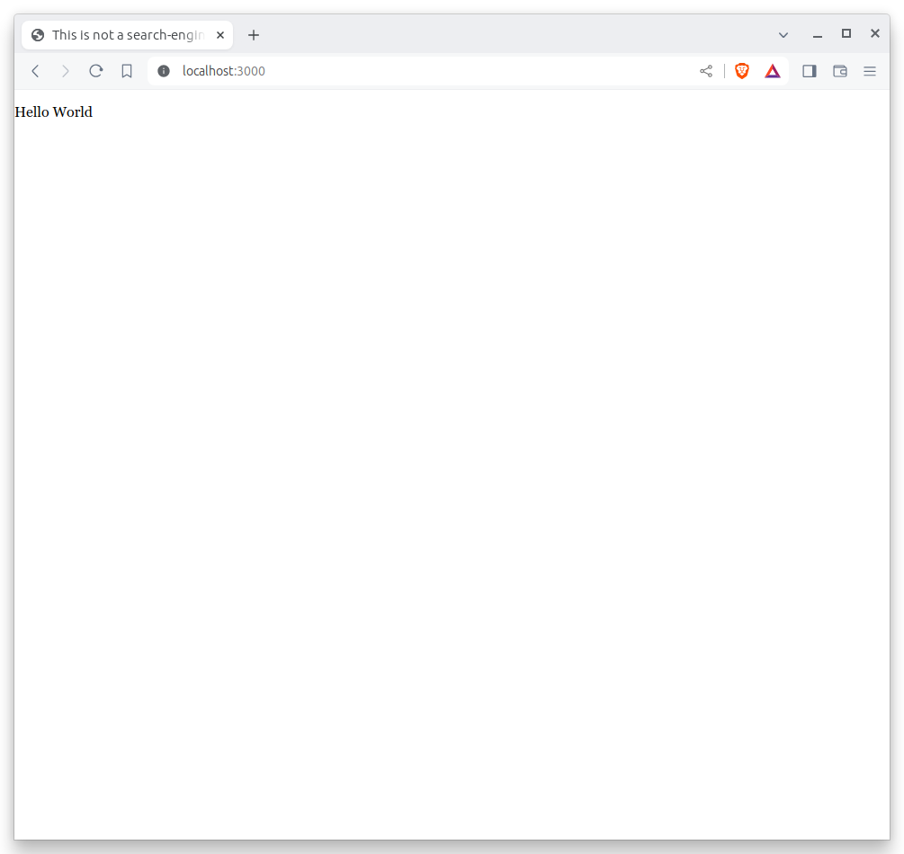
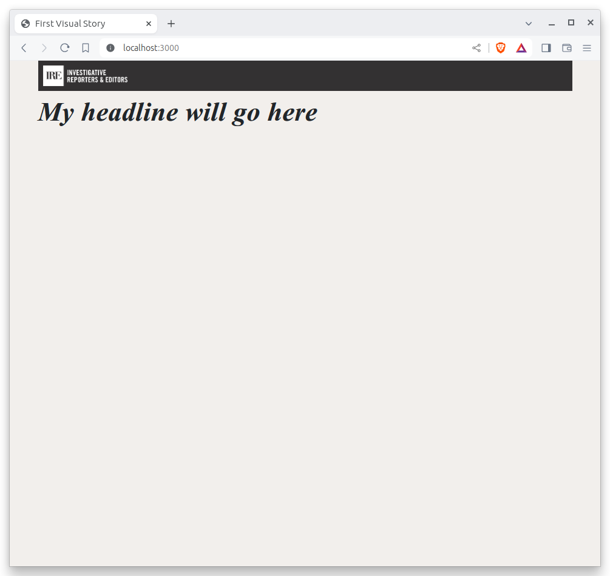
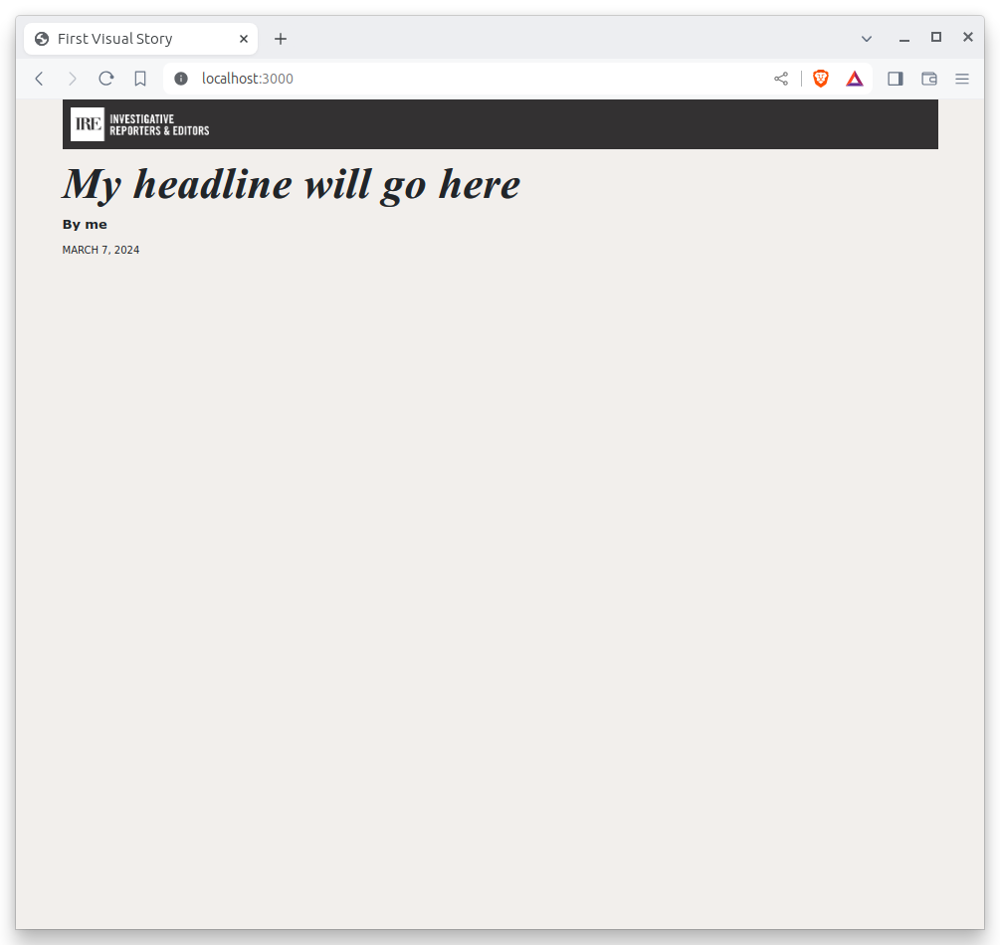

# Template

This chapter will show you how to start editing content and customizing your page.

## Configure the index

The contents of the page you see at [localhost:3000](https://localhost:3000) is configured in the `index.html` file found in the repository’s root directory. It uses a templating language called [Nunjucks](https://mozilla.github.io/nunjucks/).

You can edit the page by changing what's found inside of the `content` block. Delete everything you see there now and replace it with something simple like:

```{code-block} jinja
:emphasize-lines: 3



<p>Hello World</p>

```

Return to the web browser and reload the page. You should see the change appear immediately.



Now, look closely at the `index.html` file. If you have experience with HTML, you will notice that it doesn't include much of what you might expect from a web page.

For instance, you won't see the class `<html>` or `<body>` tags. Nor do you find the stylesheets that typically dicatate how a page looks.

That’s because that boilerplate has been moved back into a parent template "extended" by the index file with a line of Nunjucks code at the top of the page.

```jinja

```

That base file, sometimes called the layout, can be inherited by other pages on your site to avoid duplication and share common code. One change to a parent file instantly ripples out to all pages that extend it.

This approach to [inheritance](<https://en.wikipedia.org/wiki/Inheritance_(object-oriented_programming)>) is not just found in Nunjucks. It can be found in other templating systems, including Python ones like [Django](https://docs.djangoproject.com/en/1.7/topics/templates/) and [Jinja](http://jinja.pocoo.org). It's probably even used at some level in your organization's content-management system.

You can find baker’s base layout packaged with our framework by following the path and opening the `_layouts/base.html` file. You'll see it includes a set of block tags, like `content`, that act as placeholders for use in templates that extend it.

Make a small change to `_layouts/base.html` above the `content` block and save the file.

```{code-block} jinja
:emphasize-lines: 1

Above content


```

You should see the change on our site, with the new line appearing above the paragraph we added earlier to the index file.

```{image} _static/above-content.png
:width: 100%
```

Most newsrooms that use a similar system have their own base template for custom pages. Graphic artists and designers extend it as the first step in their work. They then develop their custom page within its confines and largely accept the furniture it provides, like the site's header and footer, fonts and common color schemes. This allows them to work more quickly, because they do not have to bother with reinventing their site’s most common elements.

For this example, we have developed a simplified base template that will act as a stand-in for a real newsroom's base template. It is not as sophisticated or complete as a real-world example, but it will provide all of the basic elements we will need.

You can find it in the code block below. Copy its contents and paste into `_layouts/base.html`, replacing everything that's there now.

```jinja
<!DOCTYPE html>
<html lang="en">
<head>
  <meta charset="utf-8">
  <title>First Visual Story</title>
  <meta name="viewport" content="width=device-width, initial-scale=1">
  
  <link rel="stylesheet" href="">
  
  <link href="https://cdn.jsdelivr.net/npm/bootstrap@5.1.3/dist/css/bootstrap.min.css" rel="stylesheet"
    integrity="sha384-1BmE4kWBq78iYhFldvKuhfTAU6auU8tT94WrHftjDbrCEXSU1oBoqyl2QvZ6jIW3" crossorigin="anonymous">
  <link rel="stylesheet" href="https://palewi.re/docs/first-visual-story/_static/css/tutorial.css">
  
  
  
  <script src="https://cdn.jsdelivr.net/npm/masonry-layout@4.2.2/dist/masonry.pkgd.min.js"
    integrity="sha384-GNFwBvfVxBkLMJpYMOABq3c+d3KnQxudP/mGPkzpZSTYykLBNsZEnG2D9G/X/+7D" crossorigin="anonymous"
    async></script>
</head>
<body>
    <nav>
        
    </nav>
  <header>
    <h1></h1>
    <div class="byline">
        
    </div>
    <div class="pubdate">
        
    </div>
  </header>
  
  
</body>
</html>
```

## Fill in the blocks

As you can see, it includes all of the standard HTML tags, with our custom stylesheets and content blocks mixed in.

To see the effects, return to `index.html` and fill in a headline using the `headline` block introduced by our base template. Save the page and you should quickly see it appear on the page.

```{code-block} jinja
:emphasize-lines: 3


My headline will go here
```



Now fill in a byline.

```{code-block} jinja
:emphasize-lines: 4


My headline will go here
By me
```


And let's do the publication date too while we are at it.

```{code-block} jinja
:emphasize-lines: 5-7


My headline will go here
By me

  <time datetime="2024-03-07" pubdate>March 7, 2024</time>

```



## Commit your work

You’ve installed a base template and started in on creating your first custom page. Now is a good time to pause and log your work with GitHub.

The first git command to learn is [`status`](https://git-scm.com/docs/git-status), which prints out a report card on the current state of your repository.

If your [localhost:3000](https://localhost:3000) server is still running, hit CTRL-C or CTRL-Z in the terminal to terminate its process. We'll use the terminal to log our work with GitHub.

```bash
git status
```

The next step is to instruct git to track the new files with the [`add`](https://git-scm.com/docs/git-add) command.

Rather than introduce files one by one, you can add more than one file by using a [wildcard character](https://en.wikipedia.org/wiki/Wildcard_character) in your command. One common shortcut is `git add .`, which will add all of the files in your repository at once.

```bash
git add .
```

Logging changes also requires using the [`commit`](https://git-scm.com/docs/git-commit) command, which expects a summary of your work after the `-m` flag.

```bash
git commit -m "First commit"
```

````{warning}
If this is your first time using git, you may be prompted to configure you name and email. If so, take the time now, like so:

```bash
git config --global user.email "your@email.com"
git config --global user.name "your name"
```

Then run the `commit` command above again.
````

The final step is to synchronize the changes we’ve made on our computer with the copy of the repository hosted on github.com. This is done via the [`push`](https://git-scm.com/docs/git-push) command. This complicated git command requires two inputs.

First, `push` asks for the name of the remote repository where you’d like to send your changes. In the parlance of git, the default target is `origin`.

Second, you need to provide the [branch](<https://en.wikipedia.org/wiki/Branching_(version_control)>) of the code you’d like to sync. Branching is a tool for maintaining parallel versions of your code within the same respository. We won't get that sophisticated in this tutorial, so you can stick to the default code branch, which is called `main`.

Taking all that into account, the command to push local changes to GitHub is typically the following. Try it.

```bash
git push origin main
```

You just created your first code commit. Reload your repository on GitHub and see your handiwork.

Next it’s time to load in some real data and start sculpting it on the page.
