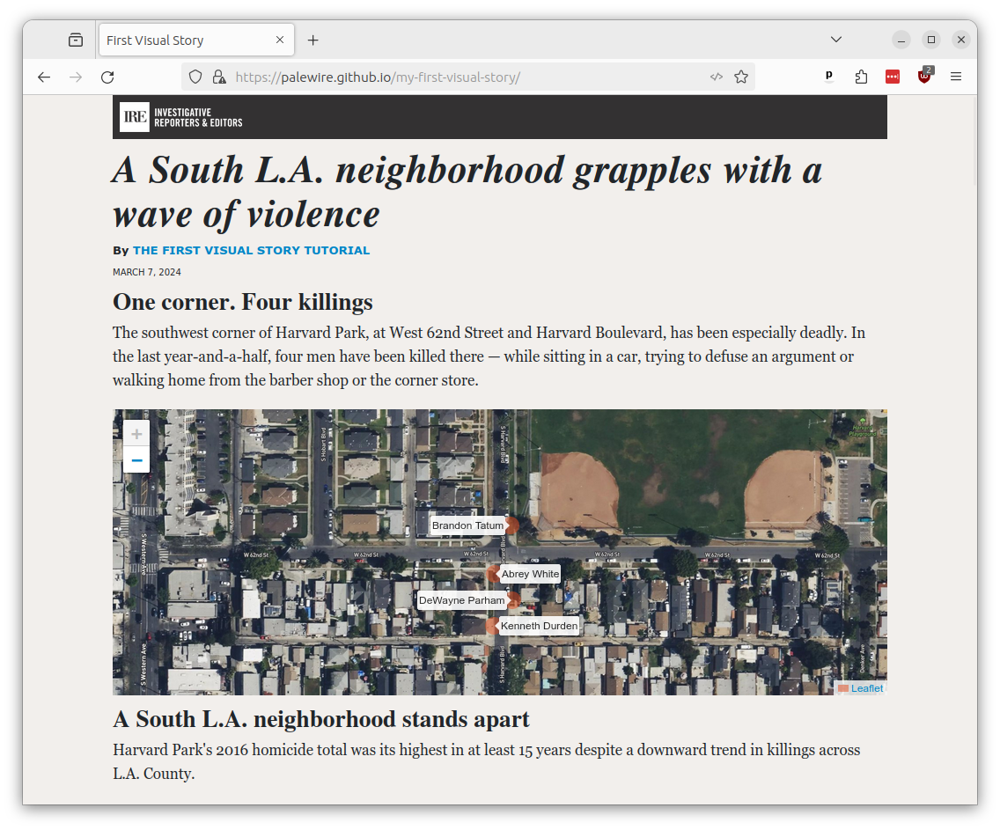

# What you will make

As part of this class, you'll gain a basic understanding of how graphics, design and data teams in the journalism industry build customized webpages.

The tutorial will demonstrate how to:

- Use a [command-line interface](https://en.wikipedia.org/wiki/Command-line_interface) to issue commands
- Write [JavaScript](https://en.wikipedia.org/wiki/JavaScript), [HTML](https://en.wikipedia.org/wiki/HTML) and [CSS](https://en.wikipedia.org/wiki/CSS) within a [static-site framework](https://github.com/datadesk/baker-example-page-template)
- Version and share your code with [git](https://en.wikipedia.org/wiki/Git) and [GitHub](https://github.com/)
- Publish a [microsite](https://en.wikipedia.org/wiki/Microsite) with [GitHub’s Pages](https://pages.github.com/)

By the end of this lesson, you will deploy a standalone page with a series of graphics examining the high homicide rate in Harvard Park, a small neighborhood in South Los Angeles.

You will create the page by repurposing data from [a 2017 Los Angeles Times story](http://www.latimes.com/projects/la-me-harvard-park-homicides/) by Nicole Santa Cruz and Cindy Chang.

A working example can be found at [palewire.github.io/first-visual-story/](https://palewire.github.io/first-visual-story/)
